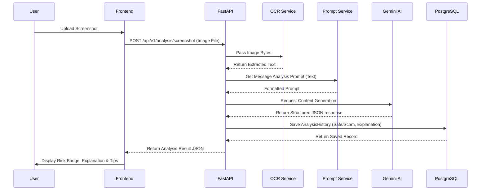

# SurakshaAI Architecture

## High Level Architecture

```mermaid
graph TD
    subgraph Frontend [React Frontend (Vite)]
        UI[User Interface]
        AuthCtx[Auth Context]
        ThemeCtx[Theme Context]
        LangCtx[Language Context]
        Axios[Axios API Client]
        
        UI --> AuthCtx
        UI --> ThemeCtx
        UI --> LangCtx
        UI --> Axios
    end

    subgraph Backend [FastAPI Backend]
        API[API Routers]
        AuthServ[Auth Service]
        AIServ[AI Service]
        OCRServ[OCR Service]
        PromptServ[Prompt Service]
        DB[Database Session]
        
        API --> AuthServ
        API --> AIServ
        API --> OCRServ
        API --> DB
        
        AIServ --> PromptServ
    end

    subgraph ExternalServices [External Services]
        Gemini[Google Gemini API]
        Tesseract[Tesseract OCR Engine]
        Postgres[(PostgreSQL Database)]
    end

    Axios -- "REST (JSON)" --> API
    AIServ -- "HTTPS" --> Gemini
    OCRServ -- "Local Process" --> Tesseract
    DB -- "SQLAlchemy ORM" --> Postgres
```

## Data Flow Diagram (Analysis)


