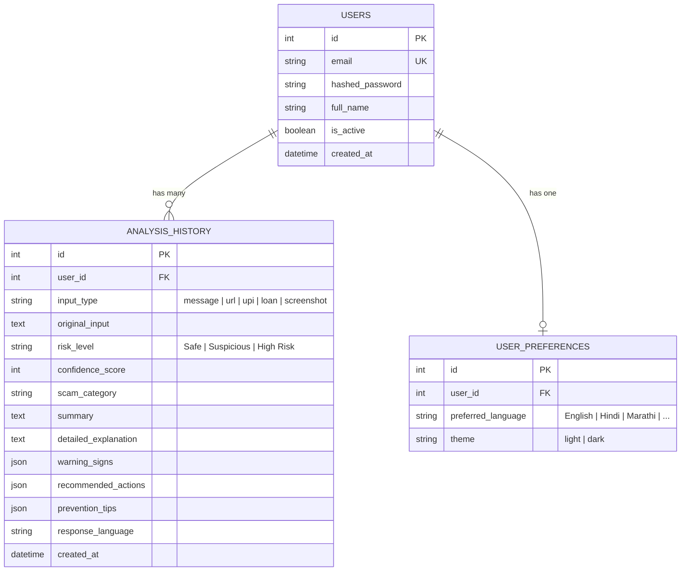

# Entity Relationship Diagram

```mermaid
erDiagram
    USERS ||--o{ ANALYSIS_HISTORY : "has many"
    USERS ||--o| USER_PREFERENCES : "has one"

    USERS {
        int id PK
        string email UK
        string hashed_password
        string full_name
        boolean is_active
        datetime created_at
    }

    ANALYSIS_HISTORY {
        int id PK
        int user_id FK
        string input_type "message | url | upi | loan | screenshot"
        text original_input
        string risk_level "Safe | Suspicious | High Risk"
        int confidence_score
        string scam_category
        text summary
        text detailed_explanation
        json warning_signs
        json recommended_actions
        json prevention_tips
        string response_language
        datetime created_at
    }

    USER_PREFERENCES {
        int id PK
        int user_id FK
        string preferred_language "English | Hindi | Marathi | ..."
        string theme "light | dark"
    }
```
